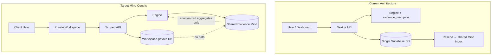

# Stage 1: Evidence Intelligence Engine — Inspection & Privacy Gap Report

**Date:** 2026-05-16  
**Scope:** Read-only inspection. No schema, code, or prompt changes. Implementation waits for explicit approval of the next phase.

**Strategic context:** Evolve from a one-off claim checker to a **persistent Evidence Mind** — one shared evidence intelligence layer with **multiple secure private client workspaces**. The shared layer should learn **what claims mean**, not **how clients say them**.

---

## Current Architecture Summary

The app is a **Next.js 14 (App Router)** wellness/longevity **claim checker**. It takes a user question, generates an LLM answer, extracts structured claims, matches them to a **curated evidence map**, runs **deterministic policy rules**, scores coherence, and **rewrites** the answer to align certainty with evidence. Optional PubMed/Semantic Scholar enrichment and optional **Supabase persistence** sit outside the core engine.

| Layer | Location | Role |
|--------|----------|------|
| UI | `app/page.tsx` (demo), `app/dashboard/page.tsx` + `components/*` | Demo shows guarded output only; dashboard shows full pipeline, study search, menu/product copy helpers, Animoca operator tools |
| API | `app/api/*` | Thin POST handlers |
| App orchestration | `lib/analysis/run-analysis.ts` | `analyze()` → optional persist → optional Animoca enqueue/email |
| Engine | `engine/orchestrator/analyze.ts` + `engine/services/*` | Pure TS pipeline; reads `data/evidence_map.json` at runtime |
| Persistence | `lib/persistence/*` | Feature-flagged Supabase writes (service role) |
| External IO | `lib/pubmed.ts`, `lib/study-search.ts` | Literature APIs |
| Operator / Mind handoff | `lib/animoca/*`, `lib/email/send-resend.ts` | Briefs, task queue rows, Resend email to `evidence.intelligence.engine@amind.ai` |

**Domain focus today:** Longevity/biohacking interventions in `data/evidence_map.json` (~47 entries). Out-of-scope or not-in-map queries return canned messages without LLM analysis.

**v2 status:** Phases 1–8 of `docs/EIE-v2-upgrade-plan.md` are largely implemented (split services, Supabase schema, persistence, model router logging, Animoca scaffolding). There is **no** multi-tenant workspace model, auth, or shared-vs-private data partitioning.

---

## Current Data Flow

```txt
User query (dashboard/demo)
    → POST /api/analyze
        → runAnalysisWithMeta (lib/analysis/run-analysis.ts)
            → analyze() (engine/orchestrator/analyze.ts)
                1. loadEvidenceMap() — data/evidence_map.json (cached in memory)
                2. isQueryInScope() — keyword match vs map; else canned out-of-scope / not-in-map
                3. LLM raw_answer (model router → OpenAI)
                4. extractClaims() — LLM JSON array
                5. detectFlags() — policy-engine rules vs map
                6. computeCoherenceScore() — 100 − sum(penalties)
                7. rewriteResponse() — LLM with flags + evidence-strength ordering
                8. [optional] PubMed topic summary + per-claim study search (if includePubmed)
            → [if EIE_PERSIST_ANALYSIS + Supabase env]
                persistCompletedAnalysis() — analyses, claims, flags, rewrites, claim_evidence_links
                → [optional] enqueueAnimocaTasksAfterPersist (review_flagged_analysis)
                → [optional] auto-email brief to Mind (EIE_EMAIL_ANIMOCA_AFTER_ANALYSIS)
            → JSON response (+ header x-eie-analysis-id when persisted)

Dashboard follow-ups (separate requests):
    POST /api/claim-studies — PubMed + Semantic Scholar per claim
    POST /api/menu-description | /api/product-description — LLM paraphrase of guarded_output only
    POST /api/animoca/brief | /api/animoca/send — load persisted analysis → email to Mind
```

Downstream copy routes **do not** re-run the evidence engine; they only paraphrase `guardedOutput`.

---

## Detailed Inventory

### 1. Application structure

```
app/                    # Routes + pages
  api/analyze|claim-studies|menu-description|product-description|animoca/brief|animoca/send
  dashboard/, page.tsx, layout.tsx, globals.css
engine/                 # Core logic
  orchestrator/analyze.ts
  services/             # claim-parser, policy-engine, scoring, rewrite, evidence-map
  llm/                  # provider, model-router, task-types
  prompts/registry.ts
  types.ts
  index.ts              # exports analyze + types
  claim-extractor.ts, certainty-alignment.ts, ...  # thin re-exports to services/*
lib/
  analysis/run-analysis.ts
  persistence/, model-runs/, animoca/, supabase/, pubmed, study-search, email
components/demo/, components/dashboard/
data/evidence_map.json
supabase/migrations/
scripts/                # smoke, verify, seed
docs/EIE-v2-upgrade-plan.md
```

### 2. API routes (all POST unless noted)

| Route | Purpose |
|-------|---------|
| `/api/analyze` | Main pipeline; `query`, `includePubmed` (defaults true) |
| `/api/claim-studies` | `claimText` + `originalQuery` → study list |
| `/api/menu-description` | `guardedOutput` + `originalQuery` → 3 spa-style blurbs |
| `/api/product-description` | Same shape → 3 product-safe descriptions |
| `/api/animoca/brief` | `analysis_id` → email-formatted brief (no send) |
| `/api/animoca/send` | `analysis_id` → Resend to Mind |

**Notable:** `/api/analyze` does **not** accept `product` / `source` on the wire today, though `AnalyzeInput` and persistence support them.

### 3. Data model / database schema

Single migration: `supabase/migrations/20260419120000_initial_schema.sql`

| Table | Purpose |
|-------|---------|
| `products` | Brand, name, SKU, category, region, metadata |
| `sources` | label/url/pdf/brochure/manual/upload + text fields |
| `analyses` | Query, raw/guarded responses, scores, pubmed JSON, review columns, optional product/source FKs |
| `claims` | Per-analysis claims with index, type, certainty |
| `evidence_entries` | Structured global evidence catalog (seeded from JSON) |
| `claim_evidence_links` | Claim ↔ evidence_entry |
| `evidence_flags` | Policy hits with severity, penalty, message |
| `rewrites` | Canonical guarded text (`kind=guarded`) |
| `model_runs` | LLM audit rows per task |
| `animoca_tasks` | Internal task queue |

Enums: `source_type`, `review_status`.

**Missing for Mind-Centric:** `workspace` / `tenant` / `client_id`, jurisdiction profile, brand voice, approved/rejected lexicons, document library, user/auth, RLS policies.

### 4. Supabase usage

- **Client:** `lib/supabase/server.ts` — singleton **service role** client (bypasses RLS).
- **When used:** Persistence (`EIE_PERSIST_ANALYSIS`), `model_runs`, Animoca brief/send, seed script, smoke/verify scripts.
- **Engine:** Does **not** read evidence from Postgres at runtime; always `data/evidence_map.json`.
- **RLS:** **None** defined in migrations. Anon key documented as future-only in `.env.local.example`.

### 5. Persistence logic

- **Gate:** `EIE_PERSIST_ANALYSIS` + `NEXT_PUBLIC_SUPABASE_URL` + `SUPABASE_SERVICE_ROLE_KEY` (`lib/persistence/persist-config.ts`).
- **Writer:** `lib/persistence/analysis-repository.ts` — insert analysis → claims → optional `claim_evidence_links` (best-effort) → flags → rewrites; rollback analysis row on failure.
- **Product/source:** Inserted only if `AnalyzeInput.product` / `.source` provided (not wired from `/api/analyze` today).
- **Response:** `x-eie-analysis-id` header when persist succeeds; failures are non-fatal to API.

### 6. Claim extraction

- **File:** `engine/services/claim-parser.ts`
- **Method:** LLM with fixed system prompt → JSON array (`claim_text`, `claim_type`, `detected_certainty_level`).
- **Types:** mechanistic | biomarker | lifespan_outcome | healthspan_outcome | intervention_effect | other.
- **Failure:** Invalid JSON → empty claims array (no hard fail).

### 7. Evidence loading / retrieval

| Path | Mechanism |
|------|-----------|
| Runtime scoring | `engine/services/evidence-map.ts` reads `data/evidence_map.json` (in-process cache) |
| Matching | `getMentionedInterventions()` — substring/stem match on intervention names |
| DB | `evidence_entries` populated via `npm run seed:evidence`; used for **persisted links**, not live analyze reads |
| External | `lib/pubmed.ts` (topic + claim-level counts), `lib/study-search.ts` (RCT/meta + study cards) |

### 8. Risk scoring / policy engine

- **File:** `engine/services/policy-engine.ts` (legacy name `certainty-alignment.ts` re-exports it).
- **Rules (4 flag types):** lifespan certainty mismatch, mechanism→lifespan extrapolation, unsupported causal framing, minor certainty inflation.
- **Scoring:** `engine/services/scoring-service.ts` — start 100, subtract penalties (10–25 per flag), clamp 0–100.
- **Config:** Rules are **hard-coded TS**, not DB or per-client config.

### 9. Rewrite generation

- **File:** `engine/services/rewrite-service.ts`
- **Input:** Raw response + claims + flags + evidence map context (strength ordering, study-type labels, soften instructions).
- **LLM task:** `rewrite` tier (reasoning model if `EIE_OPENAI_MODEL_REASONING` set, else downgrade to cheap).

### 10. Model logging

- **Router:** `engine/llm/model-router.ts` wraps each completion; calls `logModelRunNonFatal`.
- **Store:** `model_runs` — task_type, prompt_version, provider, model, latency, status, router metadata JSON.
- **Does not store:** Full prompt/response bodies in `model_runs` (only metadata). User content lives in `analyses` / `claims` when persistence is on.
- **Gating:** Same as persistence flag; skipped silently if misconfigured.

### 11. Animoca / Minds integration

| Component | Behavior |
|-----------|----------|
| `animoca_tasks` | DB queue; types: `review_flagged_analysis`, `analyst_brief`, `stale_evidence_check`, `digest_daily`, `digest_weekly` |
| Enqueue | `EIE_ENQUEUE_ANIMOCA_TASKS` — after persist, if `evidence_flags.length > 0` |
| Brief | `lib/animoca/brief-builder.ts` — reads full analysis from DB |
| Email | Resend → `EIE_EMAIL_TO_MIND` or `evidence.intelligence.engine@amind.ai` |
| External API | **None** — no Animoca HTTP client, webhook, or chat UI |

Email brief includes **full** query, raw/guarded responses, claims, flags, product/source JSON (`lib/animoca/email-brief.ts`).

### 12. Environment variables & feature flags

| Variable | Effect |
|----------|--------|
| `OPENAI_API_KEY` | Required for LLM |
| `NEXT_PUBLIC_SUPABASE_URL`, `SUPABASE_SERVICE_ROLE_KEY` | Persistence / DB tools |
| `EIE_PERSIST_ANALYSIS` | Persist analyses + enable model_runs logging |
| `EIE_ENQUEUE_ANIMOCA_TASKS` | Post-persist task enqueue |
| `EIE_EMAIL_*`, `RESEND_API_KEY` | Send to Mind |
| `EIE_EMAIL_ANIMOCA_AFTER_ANALYSIS` | Auto-email on flagged persist |
| `EIE_OPENAI_MODEL_CHEAP` / `REASONING` / `PREMIUM` | Router tiers |
| `PUBMED_EMAIL`, `SEMANTIC_SCHOLAR_API_KEY` | Literature APIs |

### 13. Privacy boundaries (current)

**Effectively none at the application layer:**

- No authentication on API routes.
- No tenant/workspace column or query filter.
- Service role = full database access from server.
- No RLS; no row ownership.
- Single global evidence map (appropriate for “shared Mind learns what claims mean”).
- All persisted client wording (queries, claims, rewrites) in **one shared table space**.
- Operator email and briefs export **complete** analysis artifacts to a shared Mind inbox.
- No redaction, tokenization, or “generic claim fingerprint” layer before shared learning.
- `docs/EIE-v2-upgrade-plan.md` explicitly lists **“heavy multi-tenant complexity”** as a non-goal for early v2.

**Partial mitigations (operational, not architectural):**

- Persistence and Animoca enqueue are **off by default**.
- Animoca/email work is **non-blocking** and optional.
- Engine can run with **no DB** (JSON map only).

### 14. Tests & validation

| Asset | Type |
|-------|------|
| `scripts/eie-smoke.mjs` | HTTP parity smoke for `/api/analyze`; optional DB coherence |
| `scripts/verify-persistence-coherence.mjs` | DB-only child-table checks |
| `scripts/seed-evidence-entries.mjs` | JSON → `evidence_entries` |
| `npm run lint`, `npm run build` | ESLint + Next build |
| Unit/integration tests | **None** (no Jest/Vitest/Playwright in repo) |

---

## Gap Analysis: Current State vs “Persistent Evidence Mind”

Strategic target:

> One shared Evidence Mind with multiple secure private client workspaces. The shared layer learns **what claims mean**, not **how clients say them**.

| Capability | Today | Gap |
|------------|-------|-----|
| Shared evidence intelligence | Global `evidence_map.json` + optional `evidence_entries` | No pipeline to promote **anonymized** claim-class/risk patterns into shared layer while excluding client phrasing |
| Client workspaces | None | Need workspace entity, auth, and scoped CRUD |
| Jurisdiction / brand voice / menus / approved language | Not modeled | Schema + APIs + engine hooks absent |
| Uploaded documents | `sources` table exists; no upload API or extraction pipeline | Wiring + storage + PII handling needed |
| Review history per client | `review_*` on `analyses` only, global table | Must be workspace-scoped |
| IP isolation | All rows commingled | Need strict `workspace_id`, RLS, no cross-tenant reads; separate blobs for proprietary copy |
| Shared learning without leakage | N/A | Need explicit **export/sanitization** boundary (e.g. claim_type + flag_type + evidence_label aggregates only) |
| Mind handoff | Email with full client text | Acceptable for **operator** workflow if workspace-bound; risky as default for multi-client SaaS |
| AuthN/AuthZ | Open APIs | Required before any multi-client production use |

### Architecture comparison (conceptual)



---

## Privacy & Confidentiality Risk Summary

| Risk | Severity | Notes |
|------|----------|-------|
| Open `/api/analyze` with persistence on | **High** | Anyone who can hit the deployment can write full queries/responses to DB |
| Service role without RLS | **High** | Any server bug or key leak exposes all clients’ data |
| Email brief content | **High** | Full raw/guarded text and claims sent to shared mailbox |
| Shared DB, no `workspace_id` | **High** | Cannot enforce “client A never sees client B” in SQL |
| LLM prompts include client text | **Medium** | OpenAI processing; no data-processing agreement layer in code |
| `model_runs.metadata` | **Low–Medium** | Router info only today; could grow to leak prompts if extended carelessly |
| Global evidence map | **Low** | Curated generic interventions — aligned with shared Mind |
| Logs (`console.info` analysis_id) | **Low** | Operational; may log IDs in shared log sinks |

---

## What Is Already Aligned (Reuse Candidates)

- **Thin routes + `runAnalysisWithMeta`** — good seam to inject workspace context and persistence policy.
- **`products` / `sources` / review columns** — partial schema for client artifacts; need workspace FKs and APIs.
- **`evidence_entries` + `claim_evidence_links`** — foundation for shared evidence catalog separate from client copy.
- **`animoca_tasks` as async boundary** — matches “Mind off hot path”; should enqueue **sanitized** payloads per workspace policy.
- **Feature flags** — pattern for rolling out workspace isolation and shared-learning exporters gradually.
- **Golden-reference discipline** (`docs/EIE-v2-upgrade-plan.md` §0) — protects analyze API shape during migration.

---

## Recommended Next Phase (For Approval — Not Implemented)

When Phase 2 planning/implementation is approved, a sensible sequence would be:

1. **Design** `workspaces` (or `organizations`) + `workspace_id` on all client-owned tables; RLS policies; auth (Supabase Auth or external IdP).
2. **Define** shared vs private data classes (document in code/types): what may enter `evidence_entries` / aggregate tables vs what must stay workspace-private.
3. **Wire** `/api/analyze` (and dashboard) to pass workspace context; stop using service role for tenant reads where possible.
4. **Add** workspace profile tables (jurisdiction, brand_voice, approved/rejected terms, treatment menu) without changing engine semantics initially.
5. **Refactor** Mind email/brief to optional **redacted** mode and workspace-scoped recipients.
6. **Introduce** anonymized “claim meaning” export job (flag-gated) for shared Mind learning.

---

## Stage 1 Status

- **Inspection:** Complete  
- **Code/schema/prompt changes:** None  
- **Awaiting:** Explicit approval before Phase 2 architecture proposal or implementation
